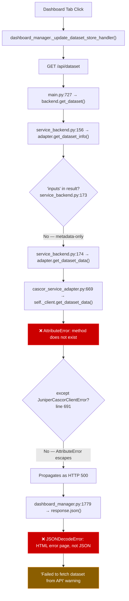

# Dataset Display Failure — Unified Root Cause Analysis

**Date**: 2026-03-30
**Affected Component**: Juniper Canopy Dashboard → Dataset View Tab
**Severity**: High
**Status**: Root causes confirmed
**Sources**: Synthesized from `juniper-ml/notes/DATASET_DISPLAY_BUG_ANALYSIS.md` and `juniper-canopy/notes/development/DATASET_DISPLAY_FAILURE_ANALYSIS.md`

---

## Table of Contents

- [Executive Summary](#executive-summary)
- [Root Causes](#root-causes)
  - [RC-1: Stale Worktree Editable Install (Primary)](#rc-1-stale-worktree-editable-install-primary)
  - [RC-2: Narrow Exception Handling in CascorServiceAdapter](#rc-2-narrow-exception-handling-in-cascorserviceadapter)
  - [RC-3: Missing get\_dataset\_data() in FakeCascorClient](#rc-3-missing-get_dataset_data-in-fakecascorclient)
- [Contributing Factors](#contributing-factors)
  - [CF-1: Version Number Not Bumped on Feature Addition](#cf-1-version-number-not-bumped-on-feature-addition)
  - [CF-2: Test Scenario Data Lacks Array Fields](#cf-2-test-scenario-data-lacks-array-fields)
  - [CF-3: Cascading Error Chain](#cf-3-cascading-error-chain)
  - [CF-4: Missing response.ok Checks in Dashboard Handlers](#cf-4-missing-responseok-checks-in-dashboard-handlers)
  - [CF-5: Worktree Hygiene](#cf-5-worktree-hygiene)
  - [CF-6: No hasattr Guard Before Client Method Call](#cf-6-no-hasattr-guard-before-client-method-call)
- [Error Flow](#error-flow)
  - [Detailed Call Chain](#detailed-call-chain)
  - [Error Flow Diagram](#error-flow-diagram)
- [Verification Evidence](#verification-evidence)
- [Impact Assessment](#impact-assessment)
- [Recommendations](#recommendations)
- [Appendix A: Cross-Environment Verification](#appendix-a-cross-environment-verification)
- [Appendix B: Adapter-to-Client Method Coverage](#appendix-b-adapter-to-client-method-coverage)
- [Appendix C: Server-Side Endpoint Status](#appendix-c-server-side-endpoint-status)

---

## Executive Summary

The Juniper Canopy Dashboard's Dataset View tab fails to display the current dataset with an `AttributeError: 'JuniperCascorClient' object has no attribute 'get_dataset_data'`.

Three root causes converge to produce this failure:

1. **Stale editable install** — The JuniperCanopy conda environment has `juniper-cascor-client` installed from a stale worktree that predates the addition of `get_dataset_data()`. Both the stale install and the current main branch report version `0.2.0`, masking the mismatch.
2. **Narrow exception handling** — The adapter catches only `JuniperCascorClientError`, allowing the `AttributeError` to escape as an unhandled HTTP 500 error.
3. **Testing gap** — `FakeCascorClient` does not implement `get_dataset_data()`, so no test could catch this regression. Demo/fake mode would also fail.

Six contributing factors amplify the failure: the version was not bumped when the method was added, test scenarios lack array data fields (forcing the fallback path), the error cascades through multiple layers producing opaque secondary errors, 6 of 12 dashboard API handlers lack `response.ok` checks, 51 stale worktrees remain uncleaned, and no `hasattr` guard exists on the client method call.

---

## Root Causes

### RC-1: Stale Worktree Editable Install (Primary)

The JuniperCanopy conda environment has `juniper-cascor-client v0.2.0` installed as an editable package, but it points to a **stale worktree** rather than the main development directory:

| Environment   | Install Source                                                                                                                                                         | Has `get_dataset_data()`? |
|---------------|------------------------------------------------------------------------------------------------------------------------------------------------------------------------|---------------------------|
| JuniperPython | `/home/pcalnon/Development/python/Juniper/juniper-cascor-client` (main, commit `6ed0fda`)                                                                              | ✅ Yes                    |
| JuniperCascor | `/home/pcalnon/Development/python/Juniper/juniper-cascor-client` (main, commit `6ed0fda`)                                                                              | ✅ Yes                    |
| JuniperCanopy | `/home/pcalnon/Development/python/Juniper/worktrees/juniper-cascor-client--fix--fake-client-response-envelope--20260326-0410--9b2ca303` (old branch, commit `d144a7c`) | ❌ **No**                 |

The worktree was created on 2026-03-26 from branch `fix/fake-client-response-envelope`, which was forked from `main` **before** the commit that added `get_dataset_data()`:

- Commit `6ed0fda` ("feat: add get_dataset_data() client method for dataset array retrieval") exists on `main`.
- The worktree branch's latest commit is `d144a7c`, which predates `6ed0fda`.

Both environments report version `0.2.0`, masking the mismatch — the version was not bumped when the feature was added.

#### Evidence

1. **pip show output** — `pip show juniper-cascor-client` in JuniperCanopy reports:

   ```bash
   Editable project location: /home/pcalnon/Development/python/Juniper/worktrees/juniper-cascor-client--fix--fake-client-response-envelope--20260326-0410--9b2ca303
   ```

2. **Runtime attribute check** — Returns `False`:

   ```bash
   /opt/miniforge3/envs/JuniperCanopy/bin/python -c \
     "from juniper_cascor_client.client import JuniperCascorClient; print(hasattr(JuniperCascorClient, 'get_dataset_data'))"
   # False
   ```

3. **Source diff** — `diff` between main branch `client.py` and worktree `client.py` confirms the worktree is missing lines 219–222 (the `get_dataset_data` method definition). Main branch `client.py` has 305 lines; worktree version has 301 lines.

4. **Module file path** — The runtime-loaded module file confirms the worktree path:

   ```bash
   module file: /home/pcalnon/Development/python/Juniper/worktrees/juniper-cascor-client--fix--fake-client-response-envelope--20260326-0410--9b2ca303/juniper_cascor_client/client.py
   ```

---

### RC-2: Narrow Exception Handling in CascorServiceAdapter

`cascor_service_adapter.py` line 691 catches only `JuniperCascorClientError`:

```python
except JuniperCascorClientError:
    return None
```

An `AttributeError` (from calling a non-existent method) is **not** a subclass of `JuniperCascorClientError`, so it escapes the handler and propagates as an unhandled exception. FastAPI converts this into an HTTP 500 error, which then triggers a cascading `JSONDecodeError` in the dashboard frontend.

If the exception handler were broader (e.g., catching `Exception`), the adapter would return `None` gracefully and the dashboard would display "No data available" instead of crashing.

---

### RC-3: Missing get\_dataset\_data() in FakeCascorClient

The `FakeCascorClient` test double at `juniper_cascor_client/testing/fake_client.py` has a `get_dataset()` method (line 631) but **no** `get_dataset_data()` method.

#### Consequences

- Tests using `FakeCascorClient` do not exercise the `get_dataset_data()` code path.
- Integration tests in juniper-canopy relying on `FakeCascorClient` silently skip this path.
- **Demo/fake mode** would also fail on the same code path — `FakeCascorClient` would raise `AttributeError`.
- This testing gap allowed RC-1 to go undetected — there was no test that would have caught the missing method on the real client.

---

## Contributing Factors

### CF-1: Version Number Not Bumped on Feature Addition

Both the old worktree and the new main code report `v0.2.0`. Adding `get_dataset_data()` (a new public API method) should have bumped the version (e.g., to `0.3.0`), which would have made the mismatch visible via `pip show`.

Additionally, there is a pre-existing version mismatch within the package itself:

- `pyproject.toml` line 7: `version = "0.2.0"`
- `__init__.py` line 11: `__version__ = "0.1.0"`

### CF-2: Test Scenario Data Lacks Array Fields

The test scenarios in `juniper_cascor_client/testing/scenarios.py` contain only metadata (`train_samples`, `test_samples`, `features`, `classes`) but not `train_x`/`train_y` arrays. This means:

- `service_backend.get_dataset()` calls `adapter.get_dataset_info()` which returns metadata-only
- Line 173 checks `"inputs" not in result` → `True` (metadata has no arrays)
- Line 174 calls `adapter.get_dataset_data()` as a **fallback** to fetch the actual arrays
- This fallback path is what triggers the `AttributeError`

The fallback path itself is correct behavior for service mode — the metadata endpoint returns lightweight info, and the data endpoint returns the full arrays. But the lack of array data in test scenarios means this critical path is never exercised in tests.

### CF-3: Cascading Error Chain

When `get_dataset_data()` is called on a client that lacks the method, the failure cascades through multiple layers, producing **two distinct errors**:

1. **`AttributeError`** at `cascor_service_adapter.py:669` — the adapter calls `self._client.get_dataset_data()` on a client instance that doesn't have the method.
2. **`JSONDecodeError`** at `dashboard_manager.py:1779` — FastAPI returns a 500 error (HTML, not JSON), and the dashboard attempts `response.json()` which fails.

The user sees an empty dataset view and cryptic secondary errors in logs, obscuring the true root cause.

### CF-4: Missing response.ok Checks in Dashboard Handlers

Investigation found that **6 of 12 API fetch handlers** in `dashboard_manager.py` do not check `response.ok` before calling `response.json()`:

| Handler                                  | Line | Endpoint               | Checks `response.ok`? |
|------------------------------------------|------|------------------------|-----------------------|
| `_update_network_info_handler`           | 1637 | `/api/status`          | ❌ No                 |
| `_update_network_info_details_handler`   | 1708 | `/api/network/stats`   | ❌ No                 |
| `_update_metrics_store_handler`          | 1732 | `/api/metrics/history` | ❌ No                 |
| `_update_topology_store_handler`         | 1762 | `/api/topology`        | ❌ No                 |
| `_update_dataset_store_handler`          | 1778 | `/api/dataset`         | ❌ No                 |
| `_update_boundary_dataset_store_handler` | 1815 | `/api/dataset`         | ❌ No                 |

This contrasts with `_update_boundary_store_handler` at lines 1797–1798, which **does** check `response.ok`. The inconsistency means all 6 handlers are vulnerable to the same `JSONDecodeError` secondary failure when the backend returns a non-JSON error response.

### CF-5: Worktree Hygiene

The stale worktree at the editable install location still exists but contains code from a feature branch, not `main`. Per project conventions (AGENTS.md), worktrees should be cleaned up promptly after merging.

The PR for branch `fix/fake-client-response-envelope` (`#11`) was merged, but:

- The worktree was **not removed**
- The editable install in JuniperCanopy was **not updated** to point at the main source directory

Investigation found **51 stale worktree directories** in `/home/pcalnon/Development/python/Juniper/worktrees/`, including:

- **35 stale `juniper-canopy-cascor--fix--connect-canopy-cascor--*` directories** (Mar 24-25)
- **6 stale `juniper-cascor--*` worktrees** (Mar 2-16)
- **4 stale `juniper-data--*` / `juniper-data-client--*` worktrees** (Mar 3-12)
- **3 stale `juniper-deploy--*` worktrees** (Mar 3-12)
- **2 stale `juniper-cascor-worker--*` worktrees** (Mar 3-12)

### CF-6: No hasattr Guard Before Client Method Call

The `cascor_service_adapter.get_dataset_data()` calls `self._client.get_dataset_data()` without checking if the method exists. A defensive `hasattr()` check would have provided an actionable log message for version mismatches and prevented the unhandled crash.

---

## Error Flow

### Detailed Call Chain

```bash
User opens Dataset View tab
    │
Dashboard calls GET /api/dataset
    │
main.py:727 → backend.get_dataset()
    │
service_backend.py:156 → adapter.get_dataset_info()   [returns metadata-only dict]
service_backend.py:173 → "inputs" not in result        [True — metadata has no arrays]
service_backend.py:174 → adapter.get_dataset_data()    [fallback path triggered]
    │
cascor_service_adapter.py:669 → self._client.get_dataset_data()
    │
JuniperCascorClient (installed from stale worktree) has no get_dataset_data()
    │
AttributeError raised
    │
cascor_service_adapter.py:691 → except JuniperCascorClientError  [does NOT catch AttributeError]
    │
Exception propagates to FastAPI → HTTP 500 (HTML error page)
    │
dashboard_manager.py:1779 → response.json()  [JSONDecodeError on HTML error page]
    │
Dataset View shows empty / "No data available"
```

### Error Flow Diagram



---

## Verification Evidence

### Installed Package Locations

```bash
# JuniperCanopy (STALE)
$ /opt/miniforge3/envs/JuniperCanopy/bin/pip show juniper-cascor-client
Version: 0.2.0
Editable project location: /home/pcalnon/Development/python/Juniper/worktrees/juniper-cascor-client--fix--fake-client-response-envelope--20260326-0410--9b2ca303

# JuniperPython (CORRECT)
$ /opt/miniforge3/envs/JuniperPython/bin/pip show juniper-cascor-client
Version: 0.2.0
Editable project location: /home/pcalnon/Development/python/Juniper/juniper-cascor-client

# JuniperCascor (CORRECT)
$ /opt/miniforge3/envs/JuniperCascor/bin/pip show juniper-cascor-client
Version: 0.2.0
Editable project location: /home/pcalnon/Development/python/Juniper/juniper-cascor-client
```

### Method Presence

```bash
# Runtime check confirms method is missing in JuniperCanopy:
$ /opt/miniforge3/envs/JuniperCanopy/bin/python -c \
  "from juniper_cascor_client.client import JuniperCascorClient; \
   print(hasattr(JuniperCascorClient, 'get_dataset_data'))"
False

# Development main (correct): client.py has 305 lines, get_dataset_data at line 219
# Stale worktree (broken): client.py has 301 lines, no get_dataset_data
```

### Git History

```bash
$ cd juniper-cascor-client && git log --oneline -5
6ed0fda feat: add get_dataset_data() client method for dataset array retrieval
0c06722 Merge pull request #11 from pcalnon/fix/fake-client-response-envelope
f38a555 Merge branch 'main' into fix/fake-client-response-envelope
8b29752 fix: align FakeCascorClient response format with real cascor ResponseEnvelope
d144a7c fix: align FakeCascorClient responses with real server ResponseEnvelope
```

Commit `6ed0fda` (adding `get_dataset_data`) is the HEAD of `main`. The worktree's latest commit `d144a7c` predates PR #11's merge at `0c06722`.

---

## Impact Assessment

| Impact                       | Severity | Description                                                                      |
|------------------------------|----------|----------------------------------------------------------------------------------|
| Dataset visualization broken | HIGH     | Users cannot view loaded dataset scatter plots in service mode                   |
| Demo/fake mode affected      | HIGH     | `FakeCascorClient` also missing the method — demo mode would crash identically   |
| Error log noise              | MEDIUM   | HTTP 500 + JSONDecodeError logged on every Dataset View tab switch               |
| No regression detection      | MEDIUM   | Tests pass because they don't exercise the fallback path with `FakeCascorClient` |
| Scope                        | BOUNDED  | Other tabs (metrics, topology, boundaries) function normally                     |
| Root cause confidence        | HIGH     | Confirmed via runtime attribute check, source diff, and git history              |

---

## Recommendations

1. **Immediate fix**: Reinstall `juniper-cascor-client` in JuniperCanopy from the main development directory
2. **Clean up stale worktree**: Remove the worktree for `fix/fake-client-response-envelope` (PR #11 already merged)
3. **Broaden exception handling**: Catch `Exception` (not just `JuniperCascorClientError`) in `cascor_service_adapter.get_dataset_data()` and other adapter methods that return safe defaults
4. **Add `hasattr` guard**: Check `hasattr(self._client, 'get_dataset_data')` before calling, with an actionable warning log for version mismatches
5. **Add `get_dataset_data()` to `FakeCascorClient`**: Close the API surface gap for both testing and demo mode
6. **Add interface conformance test**: Verify `FakeCascorClient` implements all public methods of `JuniperCascorClient`
7. **Add `response.ok` checks**: Apply to all 6 dashboard handlers that currently skip the check
8. **Bump version to 0.3.0**: Reflect the new public API method and fix the `__init__.py` / `pyproject.toml` mismatch
9. **Add data generator functions**: Add `generate_dataset_inputs()` / `generate_dataset_targets()` to `scenarios.py`
10. **Add integration test**: Exercise the full dataset fetch path through `FakeCascorClient` and `CascorServiceAdapter`
11. **Clean up 51 stale worktrees**: Address ecosystem-wide worktree hygiene

---

## Appendix A: Cross-Environment Verification

Other conda environments are **not affected** — their editable installs point to the main repo:

| Environment   | Editable Location                                                | Status     |
|---------------|------------------------------------------------------------------|------------|
| JuniperCascor | `/home/pcalnon/Development/python/Juniper/juniper-cascor-client` | ✅ Correct |
| JuniperPython | `/home/pcalnon/Development/python/Juniper/juniper-cascor-client` | ✅ Correct |
| JuniperCanopy | Stale worktree (see RC-1)                                        | ❌ Broken  |

## Appendix B: Adapter-to-Client Method Coverage

All 22 `self._client.xxx()` calls in `cascor_service_adapter.py` were cross-referenced against the worktree's `client.py`. **`get_dataset_data()` (line 669) is the only method missing from the worktree version.** All other method calls resolve correctly.

## Appendix C: Server-Side Endpoint Status

The server-side endpoint `GET /v1/dataset/data` exists and is deployed correctly:

| Component    | File                                          | Lines   | Commit    |
|--------------|-----------------------------------------------|---------|-----------|
| Route        | `juniper-cascor/src/api/routes/dataset.py`    | 24–31   | `57df9de` |
| Manager      | `juniper-cascor/src/api/lifecycle/manager.py` | 591–602 | `57df9de` |
| Registration | `juniper-cascor/src/api/app.py`               | 298     | `57df9de` |

The editable install in JuniperCascor env points to the development directory (correct). The endpoint is functioning — the problem is solely on the client/consumer side.
