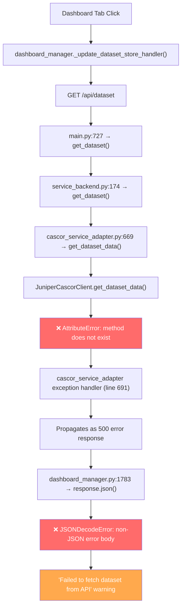

# Dataset View Tab Display Bug — Root Cause Analysis

**Date**: 2026-03-30
**Affected Component**: Juniper Canopy Dashboard → Dataset View Tab
**Severity**: High
**Status**: Root cause confirmed

---

## Table of Contents

- [Summary](#summary)
- [Root Cause 1: Stale Editable Install of juniper-cascor-client](#root-cause-1-stale-editable-install-of-juniper-cascor-client)
- [Root Cause 2: Missing get\_dataset\_data() in FakeCascorClient](#root-cause-2-missing-get_dataset_data-in-fakecascorclient)
- [Contributing Factor 1: Cascading Error Chain](#contributing-factor-1-cascading-error-chain)
- [Contributing Factor 2: Error Response Not JSON-Serializable](#contributing-factor-2-error-response-not-json-serializable)
- [Contributing Factor 3: Worktree Hygiene](#contributing-factor-3-worktree-hygiene)
- [Error Flow Diagram](#error-flow-diagram)
- [Impact Assessment](#impact-assessment)
- [Recommendations](#recommendations)

---

## Summary

The Juniper Canopy Dashboard's Dataset View tab fails to display the current dataset.
The primary root cause is a **stale editable install** of `juniper-cascor-client` in the JuniperCanopy conda environment, pointing at an old worktree that predates the addition of the `get_dataset_data()` method.
A secondary root cause is a **testing gap** in `FakeCascorClient` that allowed the issue to go undetected.
Two contributing factors — a cascading error chain and missing response validation — amplify the failure into an opaque user-facing error.

---

## Root Cause 1: Stale Editable Install of juniper-cascor-client

The JuniperCanopy conda environment has `juniper-cascor-client` installed as an editable install (`pip install -e`) pointing to a **stale worktree** at:

```bash
/home/pcalnon/Development/python/Juniper/worktrees/juniper-cascor-client--fix--fake-client-response-envelope--20260326-0410--9b2ca303
```

This worktree was created from the branch `fix/fake-client-response-envelope`, which was forked from `main` **before** the commit that added `get_dataset_data()`:

- Commit `6ed0fda` ("feat: add get_dataset_data() client method for dataset array retrieval") exists on `main`.
- The worktree branch's latest commit is `d144a7c`, which predates `6ed0fda`.

Therefore, the `JuniperCascorClient` class loaded at runtime in JuniperCanopy **does not have** the `get_dataset_data()` method, even though the method exists in the main branch source at line 219 of `client.py`.

### Evidence

1. **pip show output** — `pip show juniper-cascor-client` in JuniperCanopy reports:

   ```bash
   Editable project location: /home/pcalnon/Development/python/Juniper/worktrees/juniper-cascor-client--fix--fake-client-response-envelope--20260326-0410--9b2ca303
   ```

2. **Runtime attribute check** — Returns `False`:

   ```bash
   python -c "from juniper_cascor_client.client import JuniperCascorClient; print(hasattr(JuniperCascorClient(), 'get_dataset_data'))"
   # False
   ```

3. **Source diff** — `diff` between main branch `client.py` and worktree `client.py` confirms the worktree is missing lines 219–222 (the `get_dataset_data` method definition).

4. **Worktree source inspection** — The worktree's `client.py` has `get_dataset()` at line 215 but no `get_dataset_data()` method at all.

---

## Root Cause 2: Missing get\_dataset\_data() in FakeCascorClient

The `FakeCascorClient` test double at `juniper_cascor_client/testing/fake_client.py` has a `get_dataset()` method (line 631) but **no** `get_dataset_data()` method.

### Consequences

- Tests using `FakeCascorClient` do not exercise the `get_dataset_data()` code path.
- Integration tests in juniper-canopy relying on `FakeCascorClient` silently skip this path.
- This testing gap allowed Root Cause 1 to go undetected — there was no test that would have caught the missing method on the real client.

---

## Contributing Factor 1: Cascading Error Chain

When `get_dataset_data()` is called on a client that lacks the method, the failure cascades through multiple layers, producing **two distinct errors**:

1. **`AttributeError`** in `cascor_service_adapter.py` line 669 — the adapter's `get_dataset_data()` method (line 666) catches this via exception handling at line 691.
2. **`JSONDecodeError`** in `dashboard_manager.py` line 1783 — because the FastAPI endpoint returns a 500 error response that the Dash frontend attempts to parse as JSON.

### Call Chain

| Step | Location                        | Call                                                             |
|------|---------------------------------|------------------------------------------------------------------|
| 1    | `main.py:727`                   | `backend.get_dataset()`                                          |
| 2    | `service_backend.py:174`        | `self._adapter.get_dataset_data()`                               |
| 3    | `cascor_service_adapter.py:669` | `self._client.get_dataset_data()`                                |
| 4    | Runtime                         | **`AttributeError`** — method does not exist                     |
| 5    | FastAPI                         | Returns 500 error response                                       |
| 6    | `dashboard_manager.py:1783`     | `response.json()` on non-JSON error body → **`JSONDecodeError`** |

---

## Contributing Factor 2: Error Response Not JSON-Serializable

When the `AttributeError` propagates up through `ServiceBackend.get_dataset()`, FastAPI returns a 500 error. The `dashboard_manager.py` callback at lines 1778–1779 calls `response.json()` **without first checking `response.ok`**.

This contrasts with the decision boundary handler at lines 1797–1798, which **does** check `response.ok` before attempting JSON deserialization. The inconsistency means the dataset handler produces a secondary `JSONDecodeError` that obscures the original `AttributeError`.

---

## Contributing Factor 3: Worktree Hygiene

The stale worktree at the editable install location still exists but contains code from a feature branch, not `main`. Per project conventions (AGENTS.md), worktrees should be cleaned up promptly after merging.

The PR for branch `fix/fake-client-response-envelope` (`#11`) was merged, but:

- The worktree was **not removed**.
- The editable install in JuniperCanopy was **not updated** to point at the main source directory.

This left the runtime environment silently using an outdated version of `juniper-cascor-client`.

---

## Error Flow Diagram



---

## Impact Assessment

| Dimension                 | Assessment                                                                                     |
|---------------------------|------------------------------------------------------------------------------------------------|
| **Severity**              | High — Dataset visualization is completely broken in the Canopy dashboard                      |
| **Scope**                 | Affects the Dataset View tab; other tabs (metrics, topology, boundaries) may function normally |
| **User Impact**           | Cannot view training data scatter plots, which are needed for understanding model behavior     |
| **Detection**             | Not caught by existing tests due to `FakeCascorClient` missing the method                      |
| **Root Cause Confidence** | **Confirmed** — verified by runtime attribute check and source code diff                       |

---

## Recommendations

### 1. Immediate Fix — Re-install juniper-cascor-client from main

Re-install `juniper-cascor-client` in JuniperCanopy from the main source directory so the runtime picks up the `get_dataset_data()` method:

```bash
conda activate JuniperCanopy
pip install -e /home/pcalnon/Development/python/Juniper/juniper-cascor-client
```

### 2. Add get\_dataset\_data() to FakeCascorClient

Ensure the test double at `juniper_cascor_client/testing/fake_client.py` implements `get_dataset_data()`, matching the real client's API surface. This closes the testing gap that allowed this bug to go undetected.

### 3. Add response.ok check in dashboard\_manager

The `_update_dataset_store_handler` callback should check `response.ok` before calling `response.json()`, matching the pattern already used by `_update_boundary_store_handler` at lines 1797–1798. This prevents the secondary `JSONDecodeError` and produces a clearer error message.

### 4. Clean up stale worktree

Remove the worktree and prune metadata:

```bash
cd /home/pcalnon/Development/python/Juniper/juniper-cascor-client
git worktree remove /home/pcalnon/Development/python/Juniper/worktrees/juniper-cascor-client--fix--fake-client-response-envelope--20260326-0410--9b2ca303
git worktree prune
```

### 5. Consider interface conformance tests

Add a test that verifies `FakeCascorClient` implements all public methods that `JuniperCascorClient` exposes. This prevents future API surface drift between the real client and its test double. A simple approach:

```python
def test_fake_client_matches_real_client_api():
    real_methods = {m for m in dir(JuniperCascorClient) if not m.startswith('_')}
    fake_methods = {m for m in dir(FakeCascorClient) if not m.startswith('_')}
    missing = real_methods - fake_methods
    assert not missing, f"FakeCascorClient is missing methods: {missing}"
```

### 6. Fix response.ok checks across all dashboard\_manager API handlers

Investigation found that **6 of 12 API fetch handlers** in `dashboard_manager.py` do not check `response.ok` before calling `response.json()`:

| Handler                                  | Line | Endpoint               | Checks `response.ok`? |
|------------------------------------------|------|------------------------|-----------------------|
| `_update_network_info_handler`           | 1637 | `/api/status`          | ❌ No                 |
| `_update_network_info_details_handler`   | 1708 | `/api/network/stats`   | ❌ No                 |
| `_update_metrics_store_handler`          | 1732 | `/api/metrics/history` | ❌ No                 |
| `_update_topology_store_handler`         | 1762 | `/api/topology`        | ❌ No                 |
| `_update_dataset_store_handler`          | 1778 | `/api/dataset`         | ❌ No                 |
| `_update_boundary_dataset_store_handler` | 1815 | `/api/dataset`         | ❌ No                 |

All of these are vulnerable to the same `JSONDecodeError` secondary failure if the backend returns a non-JSON error response.

### 7. Clean up stale worktrees across the ecosystem

Investigation found **51 stale worktree directories** in `/home/pcalnon/Development/python/Juniper/worktrees/`, including:

- **35 stale `juniper-canopy-cascor--fix--connect-canopy-cascor--*` directories** (Mar 24-25)
- **6 stale `juniper-cascor--*` worktrees** (Mar 2-16)
- **4 stale `juniper-data--*` / `juniper-data-client--*` worktrees** (Mar 3-12)
- **3 stale `juniper-deploy--*` worktrees** (Mar 3-12)
- **2 stale `juniper-cascor-worker--*` worktrees** (Mar 3-12)

---

## Appendix A: Cross-Environment Verification

Other conda environments are **not affected** — their editable installs point to the main repo:

| Environment   | Editable Location                                                | Status     |
|---------------|------------------------------------------------------------------|------------|
| JuniperCascor | `/home/pcalnon/Development/python/Juniper/juniper-cascor-client` | ✅ Correct |
| JuniperPython | `/home/pcalnon/Development/python/Juniper/juniper-cascor-client` | ✅ Correct |
| JuniperCanopy | Stale worktree (see Root Cause 1)                                | ❌ Broken  |

## Appendix B: Adapter-to-Client Method Coverage

All 22 `self._client.xxx()` calls in `cascor_service_adapter.py` were cross-referenced against the worktree's `client.py`. **`get_dataset_data()` (line 669) is the only method missing from the worktree version.** All other method calls resolve correctly.
