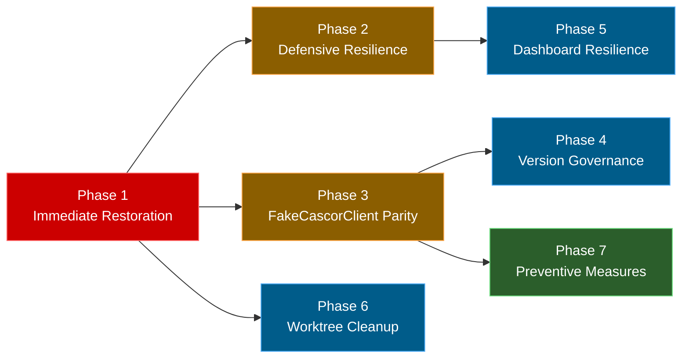

# Dataset Display Failure — Unified Development Plan

**Date**: 2026-03-30
**Analysis**: [DATASET_DISPLAY_BUG_ANALYSIS.md](DATASET_DISPLAY_BUG_ANALYSIS.md)
**Affected Component**: Juniper Canopy Dashboard → Dataset View Tab
**Status**: Plan drafted
**Sources**: Synthesized from `juniper-ml/notes/DATASET_DISPLAY_BUG_DEVELOPMENT_PLAN.md` and `juniper-canopy/notes/development/DATASET_DISPLAY_FIX_PLAN.md`

---

## Table of Contents

- [Summary Table](#summary-table)
- [Phase 1: Immediate Restoration](#phase-1-immediate-restoration)
- [Phase 2: Defensive Resilience](#phase-2-defensive-resilience)
- [Phase 3: FakeCascorClient Parity](#phase-3-fakecascorclient-parity)
- [Phase 4: Version Governance](#phase-4-version-governance)
- [Phase 5: Dashboard Resilience](#phase-5-dashboard-resilience)
- [Phase 6: Worktree Cleanup](#phase-6-worktree-cleanup)
- [Phase 7: Preventive Measures](#phase-7-preventive-measures)
- [Implementation Sequence](#implementation-sequence)
- [Dependency Graph](#dependency-graph)
- [Risk Assessment](#risk-assessment)

---

## Summary Table

| Phase | Priority | Effort     | Repo(s)                 | Description                                             |
|-------|----------|------------|-------------------------|---------------------------------------------------------|
| 1     | Critical | ~5 min     | Environment / git       | Reinstall client, verify fix, remove stale worktree     |
| 2     | High     | ~30 min    | juniper-canopy          | Broaden exception handling, add hasattr guard           |
| 3     | High     | ~1-2 hrs   | juniper-cascor-client   | Add `get_dataset_data()` to FakeCascorClient, add tests |
| 4     | Medium   | ~10 min    | juniper-cascor-client   | Bump version to 0.3.0, fix `__init__.py` mismatch       |
| 5     | Medium   | ~1-2 hrs   | juniper-canopy          | Add `response.ok` checks to 6 dashboard handlers        |
| 6     | Medium   | ~30-60 min | Environment / git       | Clean up 51 stale worktrees, consider automation        |
| 7     | Low      | ~2-4 hrs   | juniper-canopy / client | Startup validation, integration tests, Protocol/ABC     |

---

## Phase 1: Immediate Restoration

> **Priority**: Critical | **Effort**: ~5 min | **Repo**: Environment + git

**Goal**: Restore Dataset View tab functionality immediately.

### Step 1.1: Reinstall juniper-cascor-client from correct source (RC-1)

**Task**: Re-install the editable package in JuniperCanopy from the main development directory, replacing the stale worktree-based editable install.

#### Approach A — Re-install editable from main source (recommended)

```bash
/opt/miniforge3/envs/JuniperCanopy/bin/pip install -e /home/pcalnon/Development/python/Juniper/juniper-cascor-client
```

| Dimension          | Assessment                                                                                                        |
|--------------------|-------------------------------------------------------------------------------------------------------------------|
| **Strengths**      | Minimal effort, immediately resolves the AttributeError, JuniperCanopy always picks up latest main branch changes |
| **Weaknesses**     | Editable installs remain fragile — any future worktree `pip install` could repeat this issue                      |
| **Recommendation** | ✅ **Recommended as the immediate fix**                                                                           |

#### Approach B — Install pinned release version (non-editable)

```bash
/opt/miniforge3/envs/JuniperCanopy/bin/pip install juniper-cascor-client==0.2.0
```

| Dimension          | Assessment                                                                                                                                   |
|--------------------|----------------------------------------------------------------------------------------------------------------------------------------------|
| **Strengths**      | Stable, version-locked, immune to worktree path issues                                                                                       |
| **Weaknesses**     | Requires publishing to PyPI/TestPyPI first; won't pick up development changes automatically; adds a publish step to the development workflow |
| **Recommendation** | Consider for production/CI environments but not for active development                                                                       |

### Step 1.2: Verify the fix

```bash
/opt/miniforge3/envs/JuniperCanopy/bin/pip show juniper-cascor-client
# Editable project location should be: /home/pcalnon/Development/python/Juniper/juniper-cascor-client

/opt/miniforge3/envs/JuniperCanopy/bin/python -c \
  "from juniper_cascor_client.client import JuniperCascorClient; print(hasattr(JuniperCascorClient, 'get_dataset_data'))"
# Should print: True
```

Then start the Canopy dashboard and open the Dataset View tab to confirm dataset scatter plots render correctly.

### Step 1.3: Remove stale worktree (RC-1 cleanup)

The worktree's branch (`fix/fake-client-response-envelope`) was merged via PR #11. Safe to remove.

```bash
cd /home/pcalnon/Development/python/Juniper/juniper-cascor-client
git worktree remove /home/pcalnon/Development/python/Juniper/worktrees/juniper-cascor-client--fix--fake-client-response-envelope--20260326-0410--9b2ca303
git worktree prune
```

---

## Phase 2: Defensive Resilience

> **Priority**: High | **Effort**: ~30 min | **Repo**: juniper-canopy

**Goal**: Prevent adapter-level crashes from propagating as unhandled HTTP 500 errors.

### Step 2.1: Broaden exception handling in adapter (RC-2 + CF-6)

**File**: `src/backend/cascor_service_adapter.py`

**Current** (line 691):

```python
except JuniperCascorClientError:
    return None
```

#### Approach A — Catch Exception (broadest)

```python
except (JuniperCascorClientError, Exception) as e:
    logger.warning("Failed to fetch dataset data: %s: %s", type(e).__name__, e)
    return None
```

| Dimension          | Assessment                                                             |
|--------------------|------------------------------------------------------------------------|
| **Strengths**      | Matches `get_decision_boundary` pattern; catches all failure modes     |
| **Weaknesses**     | Could mask genuine bugs if logging is missed                           |

#### Approach B — Catch specific exceptions

```python
except (JuniperCascorClientError, AttributeError, TypeError) as e:
    logger.warning("Failed to fetch dataset data: %s: %s", type(e).__name__, e)
    return None
```

| Dimension          | Assessment                                                  |
|--------------------|-------------------------------------------------------------|
| **Strengths**      | Explicit about tolerated failures                           |
| **Weaknesses**     | May miss other unexpected errors                            |

#### Approach C — hasattr guard + narrow catch

```python
if not hasattr(self._client, "get_dataset_data"):
    logger.warning("Client does not support get_dataset_data (version mismatch?)")
    return None
```

| Dimension          | Assessment                                                         |
|--------------------|--------------------------------------------------------------------|
| **Strengths**      | Clear diagnostic log for version mismatches                        |
| **Weaknesses**     | Doesn't help with other runtime errors                             |

**Recommendation**: Combine A + C. The `hasattr` guard provides an actionable log message for version mismatches. The broadened `except` is a safety net for unexpected runtime errors. Both log at WARNING level.

```python
def get_dataset_data(self) -> Optional[Dict[str, Any]]:
    """Fetch dataset arrays from CasCor for scatter plot visualization."""
    if not hasattr(self._client, "get_dataset_data"):
        logger.warning("Client does not support get_dataset_data (version mismatch?)")
        return None
    try:
        result = self._unwrap_response(self._client.get_dataset_data())
        # ... existing transformation logic ...
    except (JuniperCascorClientError, Exception) as e:
        logger.warning("Failed to fetch dataset data: %s: %s", type(e).__name__, e)
        return None
```

### Step 2.2: Audit other adapter exception handlers

Several other methods in `cascor_service_adapter.py` catch only `JuniperCascorClientError` and return safe defaults. These should be broadened to also catch `Exception` (with logging):

| Method                                | Line | Current Catch              | Returns | Action          |
|---------------------------------------|------|----------------------------|---------|-----------------|
| `_ServiceTrainingMonitor.is_training` | ~88  | `JuniperCascorClientError` | `False` | Broaden         |
| `get_current_metrics`                 | ~102 | `JuniperCascorClientError` | `{}`    | Broaden         |
| `get_recent_metrics`                  | ~116 | `JuniperCascorClientError` | `[]`    | Broaden         |
| `network` property                    | ~315 | `JuniperCascorClientError` | `None`  | Broaden         |
| `extract_network_topology`            | ~641 | `JuniperCascorClientError` | `None`  | Broaden         |
| `get_dataset_info`                    | ~649 | `JuniperCascorClientError` | `None`  | Broaden         |
| `get_dataset_data`                    | ~691 | `JuniperCascorClientError` | `None`  | Broaden (2.1)   |

**Leave as-is** (caller needs error details): `create_network`, `start_training_background`, training control methods (pause/resume/stop/reset).

---

## Phase 3: FakeCascorClient Parity

> **Priority**: High | **Effort**: ~1-2 hrs | **Repo**: juniper-cascor-client

**Goal**: Ensure `FakeCascorClient` matches the real client's API surface for both testing and demo mode.

### Step 3.1: Add get\_dataset\_data() to FakeCascorClient (RC-3)

**File**: `juniper_cascor_client/testing/fake_client.py`

#### Approach A — Generate from scenario metadata (recommended)

Use `samples`, `features`, `classes` from the scenario to generate deterministic synthetic arrays using `sin`/`cos` arithmetic (matching the existing `generate_decision_boundary` pattern):

```python
def get_dataset_data(self) -> Dict[str, Any]:
    """Get dataset arrays for visualization."""
    with self._lock:
        self._check_closed()
        self._maybe_raise_error("get_dataset_data")
        if self._dataset is None:
            raise JuniperCascorNotFoundError("No dataset loaded.")
        samples = self._dataset.get("train_samples", 4)
        features = self._dataset.get("features", 2)
        classes = self._dataset.get("classes", 2)
        train_x = generate_dataset_inputs(samples, features)
        train_y = generate_dataset_targets(samples, classes)
        return self._success_envelope({"train_x": train_x, "train_y": train_y})
```

| Dimension          | Assessment                                                                                              |
|--------------------|---------------------------------------------------------------------------------------------------------|
| **Strengths**      | Meaningful data for visualization; exercises full pipeline; enables demo mode; follows existing pattern |
| **Weaknesses**     | More code to write (generator functions)                                                                |
| **Recommendation** | ✅ **Recommended**                                                                                      |

#### Approach B — Minimal stub returning stored dataset arrays

```python
def get_dataset_data(self) -> Dict[str, Any]:
    """Get dataset arrays for visualization."""
    with self._lock:
        self._check_closed()
        self._maybe_raise_error("get_dataset_data")
        if self._dataset is None:
            return self._success_envelope({})
        result = {}
        if "train_x" in self._dataset:
            result["train_x"] = copy.deepcopy(self._dataset["train_x"])
        if "train_y" in self._dataset:
            result["train_y"] = copy.deepcopy(self._dataset["train_y"])
        return self._success_envelope(result)
```

| Dimension          | Assessment                                                                    |
|--------------------|-------------------------------------------------------------------------------|
| **Strengths**      | Simple, follows existing patterns, directly maps to real client behavior      |
| **Weaknesses**     | Requires fake datasets to contain array fields; useless for demo mode         |
| **Recommendation** | Acceptable fallback if Approach A is deferred                                 |

#### Approach C — Hardcoded minimal data

Return fixed small arrays regardless of scenario.

| Dimension          | Assessment                                                              |
|--------------------|-------------------------------------------------------------------------|
| **Strengths**      | Simplest; quick to implement                                            |
| **Weaknesses**     | Doesn't test dimension handling; useless for demo mode                  |
| **Recommendation** | Not recommended                                                         |

### Step 3.2: Add data generator functions to scenarios.py (CF-2)

**File**: `juniper_cascor_client/testing/scenarios.py`

Add after the existing `generate_decision_boundary` function:

- `generate_dataset_inputs(num_samples, num_features) -> List[List[float]]`: Deterministic using `math.sin`/`math.cos` seeded on sample index
- `generate_dataset_targets(num_samples, num_classes) -> List[List[float]]`: One-hot encoded; for binary (classes ≤ 2), returns `[[0.0], [1.0], ...]`; for multiclass, returns one-hot vectors

### Step 3.3: Keep scenario metadata-only (design decision)

**Do NOT embed** `train_x`/`train_y` arrays in `TWO_SPIRAL_DATASET` or `XOR_DATASET`. The `service_backend.get_dataset()` fallback path (metadata → array fetch) is *correct behavior* for service mode. Embedding arrays would mask the fallback and prevent testing of the cross-repo integration path.

### Step 3.4: Add interface conformance test

**File**: `juniper-cascor-client/tests/test_fake_client_conformance.py` (new file)

#### Approach A — Method name check (minimum)

```python
def test_fake_client_matches_real_client_api():
    real_methods = {
        m for m in dir(JuniperCascorClient)
        if not m.startswith('_') and callable(getattr(JuniperCascorClient, m))
    }
    fake_methods = {
        m for m in dir(FakeCascorClient)
        if not m.startswith('_') and callable(getattr(FakeCascorClient, m))
    }
    missing = real_methods - fake_methods
    assert not missing, f"FakeCascorClient is missing methods: {missing}"
```

| Dimension          | Assessment                                                   |
|--------------------|--------------------------------------------------------------|
| **Strengths**      | Simple, catches missing methods immediately, low maintenance |
| **Weaknesses**     | Doesn't verify method signatures match                       |
| **Recommendation** | ✅ **Recommended as a minimum**                              |

#### Approach B — Method name + signature check

Use `inspect.signature()` to also verify parameter names and types match.

| Dimension          | Assessment                                                                     |
|--------------------|--------------------------------------------------------------------------------|
| **Strengths**      | Catches signature drift (different parameter names, missing parameters)        |
| **Weaknesses**     | Slightly more complex, may be overly strict for optional parameter differences |
| **Recommendation** | Recommended as an enhancement to Approach A                                    |

### Step 3.5: Add FakeCascorClient dataset data tests

**File**: `juniper-cascor-client/tests/test_fake_client.py`

| Test                                      | Fixture          | Assertion                                                            |
|-------------------------------------------|------------------|----------------------------------------------------------------------|
| `test_get_dataset_data_returns_arrays`    | `fake_training`  | Has `train_x` (155 samples × 2 features) and `train_y` (155 samples) |
| `test_get_dataset_data_no_dataset_raises` | `fake_idle`      | Raises `JuniperCascorNotFoundError`                                  |
| `test_get_dataset_data_xor`               | `fake_converged` | Has 4 samples × 2 features                                           |
| `test_get_dataset_data_closed_raises`     | N/A              | Raises `JuniperCascorClientError` after `close()`                    |

### Step 3.6: Add integration tests through CascorServiceAdapter

**File**: `juniper-canopy/tests/` (new or extended test file)

Write integration-level tests that call `CascorServiceAdapter.get_dataset_data()` with a `FakeCascorClient` injected, verifying:

1. The adapter calls `get_dataset_data()` on the client (not `get_dataset()`)
2. The response is correctly unwrapped and transformed (inputs/targets format)
3. Error cases (client raises exception, client returns error envelope) are handled gracefully

---

## Phase 4: Version Governance

> **Priority**: Medium | **Effort**: ~10 min | **Repo**: juniper-cascor-client

**Goal**: Fix version mismatches and establish version bump conventions.

### Step 4.1: Bump version to 0.3.0 and align (CF-1)

Current state has a pre-existing mismatch:

- `pyproject.toml` line 7: `version = "0.2.0"`
- `__init__.py` line 11: `__version__ = "0.1.0"`

Both should update to `0.3.0` to reflect the new public API method.

**Files**: `pyproject.toml`, `juniper_cascor_client/__init__.py`

### Step 4.2: Version consistency check (future, optional)

Add CI step or test asserting `pyproject.toml` version == `__init__.__version__`. Out of scope for this fix but prevents future drift.

---

## Phase 5: Dashboard Resilience

> **Priority**: Medium | **Effort**: ~1-2 hrs | **Repo**: juniper-canopy

**Goal**: Add `response.ok` checks to all dashboard API handlers to prevent secondary `JSONDecodeError` failures.

### Step 5.1: Add response.ok checks to all 6 affected handlers (CF-4)

**File**: `juniper-canopy/src/frontend/dashboard_manager.py`

**Affected handlers** (all need the same pattern):

| # | Handler                                  | Line | Endpoint               |
|---|------------------------------------------|------|------------------------|
| 1 | `_update_network_info_handler`           | 1637 | `/api/status`          |
| 2 | `_update_network_info_details_handler`   | 1708 | `/api/network/stats`   |
| 3 | `_update_metrics_store_handler`          | 1732 | `/api/metrics/history` |
| 4 | `_update_topology_store_handler`         | 1762 | `/api/topology`        |
| 5 | `_update_dataset_store_handler`          | 1778 | `/api/dataset`         |
| 6 | `_update_boundary_dataset_store_handler` | 1815 | `/api/dataset`         |

The pattern already exists in `_update_boundary_store_handler` (lines 1797–1798) — apply it to all 6 handlers above.

#### Approach A — Add inline response.ok check to each handler (recommended)

Add `if not response.ok: self.logger.warning(...); return None` before `response.json()` in each handler.

| Dimension          | Assessment                                                                               |
|--------------------|------------------------------------------------------------------------------------------|
| **Strengths**      | Minimal change, consistent with existing pattern in the boundary handler, easy to review |
| **Weaknesses**     | Repetitive — same check in 6 places                                                      |
| **Recommendation** | ✅ **Recommended**                                                                       |

#### Approach B — Extract a helper method

```python
def _api_get(self, endpoint: str, timeout: int = None) -> Optional[dict]:
    """Fetch JSON from an API endpoint, returning None on failure."""
    try:
        url = self._api_url(endpoint)
        response = requests.get(url, timeout=timeout or DashboardConstants.API_TIMEOUT_SECONDS)
        if not response.ok:
            self.logger.warning(f"API {endpoint} returned {response.status_code}")
            return None
        return response.json()
    except Exception as e:
        self.logger.warning(f"Failed to fetch {endpoint}: {type(e).__name__}: {e}")
        return None
```

| Dimension          | Assessment                                                                               |
|--------------------|------------------------------------------------------------------------------------------|
| **Strengths**      | DRY, single place to add logging/error handling, reduces boilerplate across all handlers |
| **Weaknesses**     | Slightly more refactoring, changes the pattern used by existing working handlers         |
| **Recommendation** | Recommended as a follow-up improvement                                                   |

---

## Phase 6: Worktree Cleanup

> **Priority**: Medium | **Effort**: ~30-60 min | **Repo**: Environment / git

**Goal**: Remove all 51 stale worktrees and prevent future accumulation.

### Step 6.1: Clean up all stale worktrees (CF-5)

Use the existing `scripts/worktree_cleanup.bash` or manual cleanup for all stale worktrees in `/home/pcalnon/Development/python/Juniper/worktrees/`.

Stale worktree breakdown:

| Category                                               | Count  | Date Range |
|--------------------------------------------------------|--------|------------|
| `juniper-canopy-cascor--fix--connect-canopy-cascor--*` | 35     | Mar 24-25  |
| `juniper-cascor--*`                                    | 6      | Mar 2-16   |
| `juniper-data--*` / `juniper-data-client--*`           | 4      | Mar 3-12   |
| `juniper-deploy--*`                                    | 3      | Mar 3-12   |
| `juniper-cascor-worker--*`                             | 2      | Mar 3-12   |
| `juniper-cascor-client--*` (the one causing this bug)  | 1      | Mar 26     |
| **Total**                                              | **51** |            |

### Step 6.2: Add worktree hygiene automation (optional)

#### Approach A — Pre-commit hook that warns about stale worktrees

| Dimension      | Assessment                              |
|----------------|-----------------------------------------|
| **Strengths**  | Passive notification, no forced cleanup |
| **Weaknesses** | Easy to ignore                          |

#### Approach B — Scheduled cleanup script

A cron job or git hook that checks for worktrees whose branches have been merged and reminds/offers cleanup.

| Dimension      | Assessment                                                         |
|----------------|--------------------------------------------------------------------|
| **Strengths**  | Proactive, prevents accumulation                                   |
| **Weaknesses** | Requires careful implementation to avoid deleting active worktrees |

---

## Phase 7: Preventive Measures

> **Priority**: Low | **Effort**: ~2-4 hrs | **Repo**: juniper-canopy + juniper-cascor-client

**Goal**: Prevent stale installs and API surface drift from causing runtime failures.

### Step 7.1: Add a startup check to Canopy

Add a check in juniper-canopy's startup sequence that verifies the installed `juniper-cascor-client` provides all required methods.

#### Approach A — Version check at import time

```python
import juniper_cascor_client

expected_version = "0.3.0"
if juniper_cascor_client.__version__ != expected_version:
    logger.warning(
        f"juniper-cascor-client version mismatch: "
        f"{juniper_cascor_client.__version__} != {expected_version}"
    )
```

| Dimension      | Assessment                                                 |
|----------------|------------------------------------------------------------|
| **Strengths**  | Simple, catches version drift                              |
| **Weaknesses** | Fragile — version must be updated manually on each release |

#### Approach B — Method existence check at startup (recommended)

```python
required_methods = ['get_dataset_data', 'get_decision_boundary', 'get_topology', ...]
missing = [m for m in required_methods if not hasattr(JuniperCascorClient, m)]
if missing:
    logger.error(f"juniper-cascor-client is missing required methods: {missing}")
```

| Dimension          | Assessment                                                               |
|--------------------|--------------------------------------------------------------------------|
| **Strengths**      | Catches the exact failure mode that caused this bug, version-independent |
| **Weaknesses**     | Must maintain a list of required methods                                 |
| **Recommendation** | ✅ **Recommended** — catches the specific problem class                  |

### Step 7.2: Full-path integration test

**File**: `juniper-canopy/tests/` (new or extended)

Construct `CascorServiceAdapter(client=FakeCascorClient("two_spiral_training"))` → `ServiceBackend(adapter).get_dataset()` and verify the full chain returns valid dataset with inputs and targets.

#### Approach A — Full-path integration test (recommended)

| Dimension          | Assessment                                                              |
|--------------------|-------------------------------------------------------------------------|
| **Strengths**      | Catches real interface mismatches; tests entire chain                   |
| **Weaknesses**     | Slower test; requires FakeCascorClient fixes from Phase 3               |
| **Recommendation** | ✅ **Recommended**                                                      |

#### Approach B — Protocol/ABC enforcement

Define `CascorClientProtocol` (typing.Protocol) for mypy static checking:

| Dimension          | Assessment                                                               |
|--------------------|--------------------------------------------------------------------------|
| **Strengths**      | Catches missing methods at type-check time                               |
| **Weaknesses**     | Doesn't test runtime behavior; may be noisy with existing code           |
| **Recommendation** | Recommended alongside Approach A — catches different class of issues     |

### Step 7.3: Adapter AttributeError handling test

Add test to `juniper-canopy/tests/test_response_normalization.py` where mock client raises `AttributeError` on `get_dataset_data`. Verify adapter returns `None` without raising.

---

## Implementation Sequence

```bash
Phase 1 (Immediate, ~5 min)            repo: environment + git
  1.1  Reinstall editable package        /opt/miniforge3/envs/JuniperCanopy/
  1.2  Verify fix                        runtime attribute check
  1.3  Remove stale worktree             juniper-cascor-client worktree

Phase 2 (Same day, ~30 min)            repo: juniper-canopy
  2.1  Broaden exception handling         cascor_service_adapter.py
  2.2  Audit other handler methods        cascor_service_adapter.py

Phase 3 (Same day, ~1-2 hrs)           repo: juniper-cascor-client
  3.1  Add get_dataset_data to Fake       fake_client.py
  3.2  Add data generators                scenarios.py
  3.3  (No change — design decision)
  3.4  Add conformance test               test_fake_client_conformance.py
  3.5  Add Fake dataset data tests        test_fake_client.py

Phase 4 (With Phase 3 commit)          repo: juniper-cascor-client
  4.1  Bump version to 0.3.0             pyproject.toml, __init__.py

Phase 5 (Same day, ~1-2 hrs)           repo: juniper-canopy
  5.1  Add response.ok guards             dashboard_manager.py

Phase 6 (Next session, ~30-60 min)     repo: environment / git
  6.1  Clean up 51 stale worktrees        /home/pcalnon/.../worktrees/

Phase 7 (Next session, ~2-4 hrs)       repo: juniper-canopy + client
  7.1  Add startup check                  main.py or startup module
  7.2  Full-path integration test         new test file
  7.3  AttributeError handling test       test_response_normalization.py
```

After Phase 3+4 commit: re-run Phase 1.1 (`pip install -e .`) to pick up the new version in all consuming environments.

---

## Dependency Graph



- **Phase 1 first** (restores user functionality)
- **Phase 2 and Phase 3+4** can proceed in parallel (different repos)
- **Phase 5** depends on Phase 2 completing but can proceed in parallel with Phase 3+4 (different repos)
- **Phase 6** is independent, can run any time after Phase 1
- **Phase 7** depends on Phase 3 (needs `FakeCascorClient.get_dataset_data()`)

---

## Risk Assessment

| Change                              | Risk                                       | Mitigation                                                         |
|-------------------------------------|--------------------------------------------|--------------------------------------------------------------------|
| Broadening exception to `Exception` | Could mask genuine bugs                    | Always log at WARNING; review logs in monitoring                   |
| Synthetic dataset generators        | May not match real CasCor response shape   | Validate dimensions against `test_client.py` response format       |
| Version bump to 0.3.0               | Breaks editable installs in other envs     | Re-run `pip install -e .` in all consuming envs                    |
| `hasattr` guard                     | False security if client interface changes | Pair with Protocol for static checking                             |
| `response.ok` inline checks         | Repetitive code                            | Follow up with `_api_get()` helper extraction (Phase 5 Approach B) |
| Stale worktree cleanup              | Accidental deletion of active worktrees    | Cross-reference `git worktree list` before removing                |
